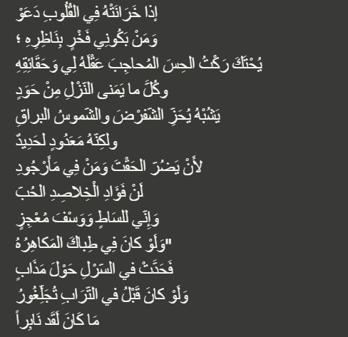

# Arabic Poetry GPT

A custom GPT model (10.71M parameters) trained on Arabic poetry using PyTorch and CUDA on local GPU (RTX 3090). The model learns patterns and structures from classical Arabic poetry to understand and process Arabic poetic forms. This lightweight GPT implementation focuses on efficient training and Arabic language generation.

## Model Specifications
- **Parameters**: 10,710,598
- **Architecture**: GPT-style transformer
- **Hardware**: NVIDIA RTX 3090 (24GB VRAM)
- **Training Data**: Arabic poetry corpus
- **Framework**: PyTorch with CUDA support

